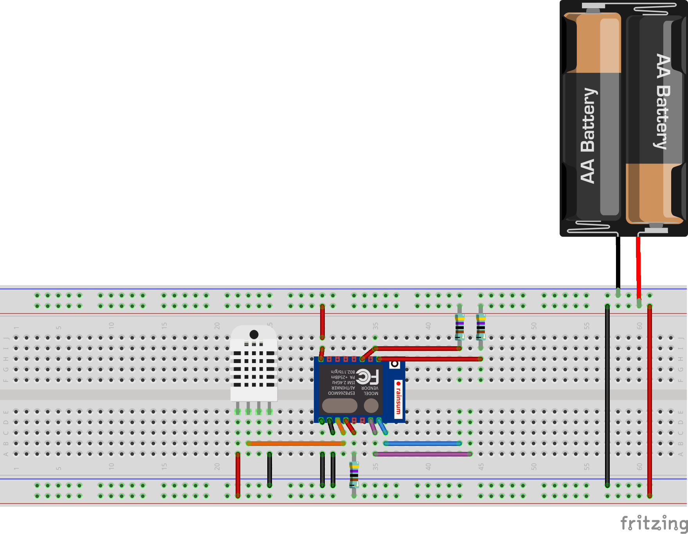
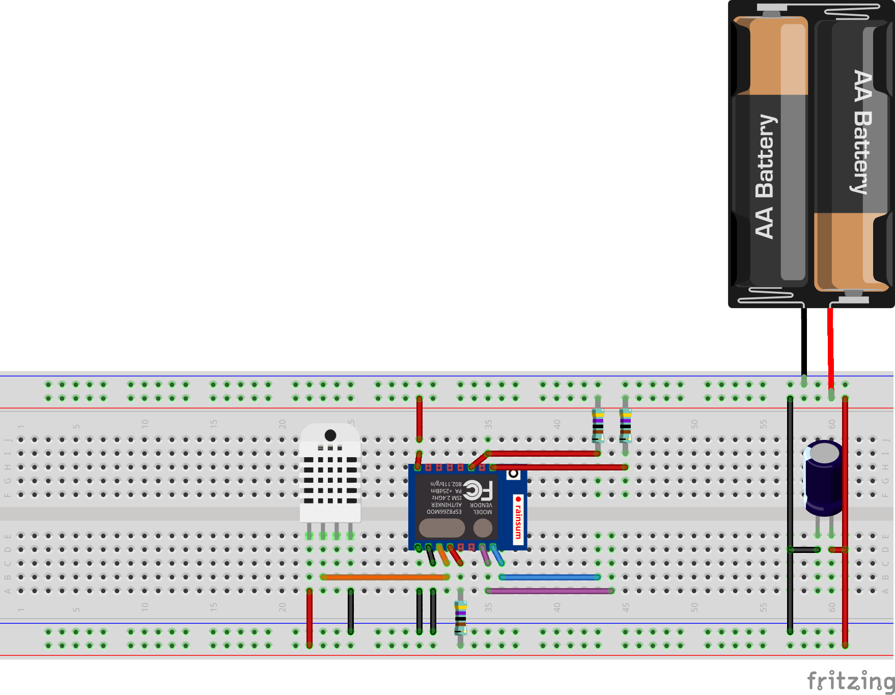
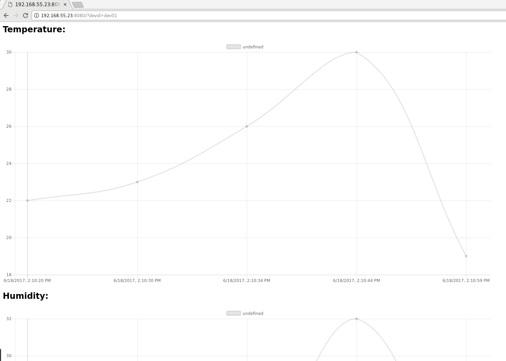

# Weatherbot
This repositor contains the sourcecode for my weatherbot PoC.

## Tanle of content
[Components](#components)

(#components)
## Components
- Webserver written in go with JSON API and JS frontend (can be run on a Raspberry Pi or in the cloud)
- Sqllite DB for persistent storage
- ESP12F with DHT22 as Wifi enabled data logger

## Installation
## Server
Install golang
~~~
sudo apt-get install golang sqlite3
~~~

Set GOPATH
~~~
mkdir $HOME/go && export GOPATH=$HOME/go
~~~

Get Weatherbot from source
~~~
go get github.com/l4r-s/go-weatherbot
~~~

### Database
Create new database in project directory
~~~
cd $GOPATH/src/github/l4r-s/go-weatherbot
sqlite3 foo.db
CREATE TABLE `data` (
    `id` INTEGER PRIMARY KEY AUTOINCREMENT,
    `devid` VARCHAR(64) NULL,
    `temp` DOUBLE NULL,
    `hum` DOUBLE NULL,
    `timestamp` DOUBLE NULL
);
Enter & Ctrl + D
~~~

### MailAlert
Edit the following constants in mailalert.go:
~~~~
const temphigh = 30.0
const humhigh = 30.0

const mailfrom = "weather@mail.l4rs.net"
const mailto = "me@l4rs.net"
const mailserver = "mail.l4rs.net"
const mailport = 587
const mailpassword = "PASSWORD"
~~~~

### Frontend
In ./static/index.html on line 15 you need to set the host variable to the IP of your server:
~~~
var host = "IPADDRESS"
~~~

### Build
Now you can build the executable
~~~
cd $GOPATH/src/github.com/l4r-s/go-weatherbot
go build
~~~

and run the server with
~~~
./go-weatherbot
~~~

## ESP12F
Currently I am running the ESP with the instable version. This means the ESP can not always pull the sensor data from the DHT22.

### Schemantic (instable operation)

#### Parts
- ESP12F
- 3x 4.7k resistors
- DHT22 sensor
- 2x AA bettery

### Schemantic (stable operation)

#### Parts
- ESP12F
- 3x 4.7k resistors
- DHT22 sensor
- 2x AA bettery
- 1000 uF capacitor

### Flashing
Flash the arduino code located under arduino/sketch to the ESP12F with the Arduino IDE.
Change the following constants in the sketch:
~~~
const char* ssid = "WLANSSID";
const char* password = "WLANPASSWORD";
const char* host = "SERVERIPADDRESS";
~~~
and on line 67 "prod01" to your device name.

# Server Frontend
## JS Frontend
Under http://SERVERIP:8080 the webserver serves a static HTML with JS file.
At the moment you can only display data from one device at the same time.

~~~
http://SERVERIP:8080/?devid={devicename}
~~~

## JSON API
The JSON API is located undet http://SERVERIPADDRESS:8080/data

### /data
~~~
lars@book:~ $ curl http://192.168.55.23:8080/data
[{"id":"1","devid":"dev01","temp":22,"hum":22,"timestamp":"2017-06-18T12:10:20Z"},{"id":"2","devid":"dev01","temp":23,"hum":23,"timestamp":"2017-06-18T12:10:30Z"},{"id":"3","devid":"dev01","temp":26,"hum":24,"timestamp":"2017-06-18T12:10:34Z"},{"id":"4","devid":"dev01","temp":30,"hum":32,"timestamp":"2017-06-18T12:10
:44Z"},{"id":"5","devid":"dev01","temp":19,"hum":20,"timestamp":"2017-06-18T12:10:59Z"}]
~~~

Will return a JSON object with temperature and humidity of all devices.

### /data/{devid}
~~~
lars@book:~ $ curl http://192.168.55.23:8080/data/dev02
[{"id":"6","devid":"dev02","temp":22,"hum":22,"timestamp":"2017-06-18T12:22:30Z"}]
~~~

Will return a JSON object with temperature and humidity of the given device name.

### /data/{devid}/temp
~~~
curl http://192.168.55.23:8080/data/dev02/temp
[{"time":1.49778855e+09,"temperature":22}]
~~~

Will return a JSON object with temperature only of the given device name.

### /data/{devid}/hum
~~~
lars@book:~ $ curl http://192.168.55.23:8080/data/dev02/hum
[{"time":1.49778855e+09,"humidity":22}]
~~~

Will return a JSON object with humidity only of the given device name.

### /data/{devid}/{temp}/{hum}
~~~
lars@book:~ $ curl -X PUT http://192.168.55.23:8080/data/dev03/22/22
[{"id":"7","devid":"dev03","temp":22,"hum":22,"timestamp":"2017-06-18T12:25:02Z"}]
~~~
Put data in the Database (this method is used by the ESP12F for sending the data).
The HTTP method used is "PUT".
